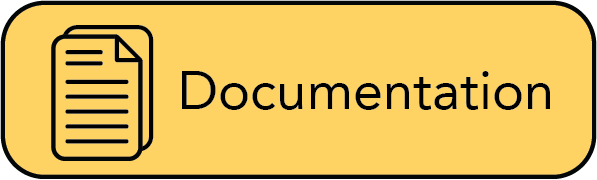
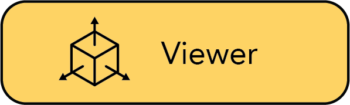

<p align="center">
    <!-- community badges -->
    <a href="https://discord.gg/NHGtYRAW"></a>
    <!-- doc badges -->
    <a href='https://plenoptix-nerfstudio.readthedocs-hosted.com/en/latest/?badge=latest'>
        
    </a>
    <!-- pi package badge -->
    <a href="https://badge.fury.io/py/nerfstudio"></a>
    <!-- code check badges -->
    <a href='https://github.com/nerfstudio-project/nerfstudio/actions/workflows/core_code_checks.yml'>
        
    </a>
    <a href='https://github.com/nerfstudio-project/nerfstudio/actions/workflows/viewer_build_deploy.yml'>
        
    </a>
    <!-- license badge -->
    <a href="https://github.com/nerfstudio-project/nerfstudio/blob/master/LICENSE">
        
    </a>
</p>

<p align="center">
    <picture>
    <source media="(prefers-color-scheme: dark)" srcset="https://docs.nerf.studio/en/latest/_images/logo-dark.png">
    <source media="(prefers-color-scheme: light)" srcset="https://docs.nerf.studio/en/latest/_images/logo.png">
    
    </picture>
</p>

<p align="center"> The all-in-one repo for NeRFs </p>

<p align="center">
    <a href="https://docs.nerf.studio">
        
    </a>
    <a href="https://viewer.nerf.studio/">
        
    </a>
</p>

- [Quickstart](#quickstart)
- [Learn more](#learn-more)
- [Supported Features](#supported-features)
- [See what's possible](#see-whats-possible)

# About

Nerfstudio provides a simple API that allows for a simplified end-to-end process of creating, training, and testing NeRFs.
The library supports a **more interpretable implementation of NeRFs by modularizing each component.**
With more modular NeRFs, we hope to create a more user-friendly experience in exploring the technology.
Nerfstudio is a contributer friendly repo with the goal of buiding a community where users can more easily build upon each other's contributions.

It’s as simple as plug and play with nerfstudio!

Ontop of our API, we are commited to providing learning resources to help you understand the basics of (if you're just getting start), and keep up-to-date with (if you're a seasoned veteran) all things NeRF. As researchers, we know just how hard it is to get onboarded with this next-gen technology. So we're here to help with tutorials, documentation, and more!

Finally, have feature requests? Want to add your brand-spankin'-new NeRF model? Have a new dataset? **We welcome any and all contributions!** Please do not hesitate to reach out to the nerfstudio team with any questions.

We hope nerfstudio enables you to build faster :hammer: learn together :books: and contribute to our NeRF community :sparkling_heart:.

# Quickstart

The quickstart will help you get started with the default vanilla nerf trained on the classic blender lego scene.
For more complex changes (e.g. running with your own data/ setting up a new NeRF graph, please refer to our [references](#learn-more).

## 1. Installation: Setup the environment

### Create environment

We reccomend using conda to manage dependencies. Make sure to install [Conda](https://docs.conda.io/en/latest/miniconda.html) before preceding.

```
conda create --name nerfstudio -y python=3.8.13;
conda activate nerfstudio
python -m pip install --upgrade pip
```

### Dependencies

Install pytorch with CUDA (this repo has been tested with CUDA 11.3) and [tiny-cuda-nn](https://github.com/NVlabs/tiny-cuda-nn)

```
pip install torch==1.12.1+cu113 torchvision==0.13.1+cu113 -f https://download.pytorch.org/whl/torch_stable.html
pip install git+https://github.com/NVlabs/tiny-cuda-nn/#subdirectory=bindings/torch
```

### Installing nerfstudio

Easy option:

```
pip install nerfstudio
```

If you would want the latest and greatest:

```
git clone git@github.com:plenoptix/nerfstudio.git
cd nerfstudio
pip install -e .
```

### Optional Installs

**Tab completion (bash & zsh)**

This needs to be rerun when the CLI changes, for example if nerfstudio is updated.

```bash
ns-install-cli
```

**Development packages**

```bash
pip install -e.[dev]
pip install -e.[docs]
```

#### 2. Getting the data

Download the original NeRF Blender dataset. We support the major datasets and allow users to create their own dataset, described in detail [here](https://plenoptix-nerfstudio.readthedocs-hosted.com/en/latest/tutorials/data/index.html).

```
ns-download-data --dataset=blender
ns-download-data --dataset=nerfstudio --capture=poster
```

Use `--help` to view all currently available datasets. The resulting script should download and unpack the dataset as follows:

```
|─ nerfstudio/
   ├─ data/
   |  ├─ blender/
   |     ├─ fern/
   |     ├─ lego/
         ...
      |- <dataset_format>/
         |- <scene>
         ...
```

## 3. Training a model

To run with all the defaults, e.g. vanilla nerf method with the blender lego image

```
# To see what models are available.
ns-train --help

# Run a vanilla nerf model.
ns-train vanilla-nerf

# Run with nerfacto model.
ns-train nerfacto

# Run with nerfstudio data. You'll may have to change the ports, and be sure to forward the "websocket-port".
ns-train nerfacto --vis viewer --viewer.zmq-port 8001 --viewer.websocket-port 8002 nerfstudio-data --pipeline.datamanager.dataparser.data-directory data/nerfstudio/poster --pipeline.datamanager.dataparser.downscale-factor 4
```

### 3.x Training a model with the viewer

Make sure to forward a port for the websocket to localhost. The default port is 7007, which you should expose to localhost:7007.

```bash
# with the default port
ns-train nerfacto --vis viewer

# with a specified websocket port
ns-train nerfacto --vis viewer --viewer.websocket-port=7008

# port forward if running on remote
ssh -L localhost:7008:localhost:7008 {REMOTE HOST}
```

### 4. Visualizing training runs

We support multiple methods to visualize training, the default configuration uses Tensorboard. More information on logging can be found [here](https://docs.nerf.studio/en/latest/tooling/logging_profiling.html).

<details>
<summary>Real-time Viewer</summary>

We have developed our own Real-time web viewer, more information can be found [here](https://docs.nerf.studio/en/latest/tutorials/viewer/index.html). This viewer runs during training and is designed to work with models that have fast rendering pipelines.

To turn on the viewer, simply add the flag `--vis viewer`.

</details>

<details>
<summary>Tensorboard</summary>

If you run everything with the default configuration we log all training curves, test images, and other stats. Once the job is launched, you will be able to track training by launching the tensorboard in your base experiment directory (Default: `outputs/`).

```bash
tensorboard --logdir outputs/
```

</details>

<details>
<summary>Weights & Biases</summary>

We support logging to weights and biases. To enable wandb logging, add the flag `--logging.writer.1.enable`.

</details>

## 5. Rendering a trajectory during inference

```
ns-eval render-trajectory --load-config=outputs/blender_lego/instant_ngp/{MOST_RECENT_RUN}/config.yml--traj=spiral --output-path=output.mp4
```

## 6. In-depth guide

For a more in-depth tutorial on how to modify/implement your own NeRF Graph, please see our [walk-through](https://docs.nerf.studio/en/latest/tutorials/pipelines/index.html).

# Learn More

| Section                                                                                 | Description                                                                                        |
| --------------------------------------------------------------------------------------- | -------------------------------------------------------------------------------------------------- |
| [Documentation](https://docs.nerf.studio/en/latest/)                                    | Full API documentation and tutorials                                                               |
| [Interactive Guides](https://docs.nerf.studio/en/latest/guides/index.html)              | Go-to spot for learning how NeRFs and each of its modules work.                                    |
| [Quick tour](https://docs.nerf.studio/en/latest/tutorials/quickstart_index.html)        | Example script on how to navigate nerfstudio from install, train, to test.                         |
| [Creating pipelines](https://docs.nerf.studio/en/latest/tutorials/pipelines/index.html) | Learn how to easily build new neural rendering pipelines by using and/or implementing new modules. |
| [Creating datasets](https://docs.nerf.studio/en/latest/tutorials/data/index.html)       | Have a new dataset? Learn how to use it with nerfstudio.                                           |
| [Mobile Capture to NerF](#)                                                             | Step-by-step tutorial on how to create beautiful renders with just your phone.                     |
| [Contributing](https://docs.nerf.studio/en/latest/reference/contributing.html)          | Walk-through for how you can start contributing now.                                               |
| [Discord](https://discord.gg/NHGtYRAW)                                                  | Join our community to discuss more. We would love to hear from you!                                |

# Supported Features

We provide the following support strucutures to make life easier for getting started with NeRFs. For a full description, please refer to our [features page](#).

**If you are looking for a feature that is not currently supported, please do not hesitate to contact the nerfstudio team!**

- :mag_right: Web-based visualizer that allows you to:
  - Visualize training in real-time + interact with the scene
  - Create and render out scenes with custom camera trajectories
  - View different output types
  - And more!
- :pencil2: Support for multiple logging interfaces (Tensorboard, Wandb), code profiling, and other built-in debugging tools
- :chart_with_upwards_trend: Easy-to-use benchmarking scripts on the Blender dataset
- :iphone: Full pipeline support (w/ Colmap or Record3D) for going from a video on your phone to a full 3D render. Follow our step-by-step tutorial. (TODO: walk-through page on end-to-end pipeline from capture -> render)

# See what's possible

TODO: insert some gallery stuff here (gifs/pretty pictures w/ visualizer)
TODO: For more see gallery
