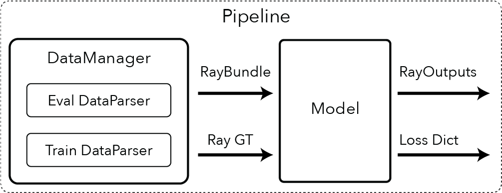
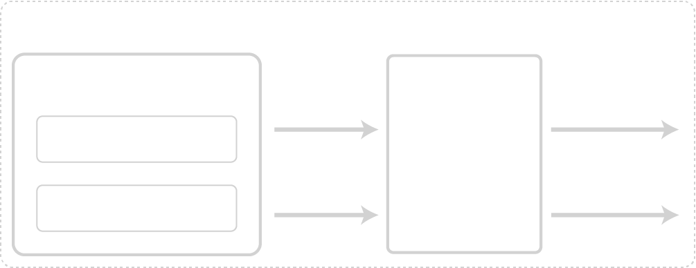

Pipelines overview
-------------------------

Here we describe what a Pipeline is and how it works. You can see an overview figure with the major Pipeline components below.

.. admonition:: Note

  RayGT and RayOutputs are currently dictionaries. In the future, they will be typed objects.

Why Pipelines?
==========================

Our goal is for any NeRF paper to be implemented as a Pipeline.

The Pipeline is composed of two major components, namely the DataManager and the Model. The DataManager is responsible for loading data and generating RayBundle and RayGT objects. RayBundles are the input to the forward pass of the Model. These are needed for both training and inference time. RayGT objects, however, are needed only during training to calculate the losses in the Loss Dict.

RayBundle objects describe origins and viewing directions. The model will take these rays and render them into quantities as RayOutputs. RayGT contains the necessary ground truth (GT) information needed to compute losses. For example, the GT pixel values can be used to supervise the rendered rays with an L2 loss.

In the following sections, we describe the Pipeline components and look at their code.

.. toctree::
    :maxdepth: 1

    dataparsers
    datamanagers
    models
    fields
    pipelines

Implementing NeRF Papers
==========================

Let's say you want to create a custom Pipeline that has a custom DataManager and a custom Model. Perhaps you care about dynamically adding cameras to the DataManager during training or you want to importance sample and generate rays from pixels where the loss is high. This can be accomplished by mixing and matching components into a Pipeline. The following guide will take you through an example of this.

This guide is coming soon!
