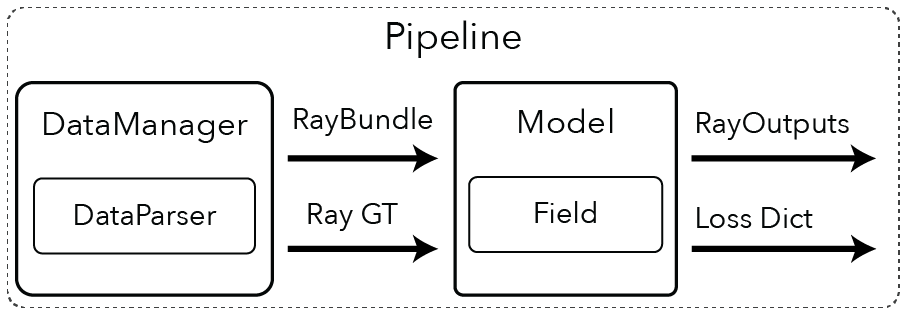
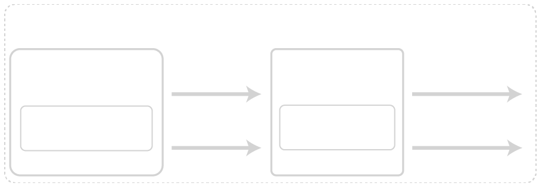

Pipelines Overview
-------------------------

Here we show you how to create a custom pipeline.

# TODO: show a figure of what a pipeline is here

.. toctree::
    :maxdepth: 1

    dataparsers.ipynb
    datamanagers.ipynb
    models.ipynb
    pipelines.ipynb
    creating_new_methods.ipynb