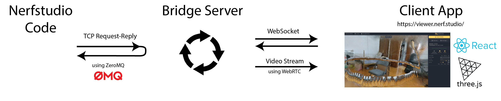

# Viewer overview

> We have a real-time web viewer that requires no installation. It's available at [https://viewer.nerf.studio/](https://viewer.nerf.studio/), where you can connect to your training job. If you want to understand how the viewer works and contribute to it's features, this section is for you!

The viewer is built using [ThreeJS](https://threejs.org/) and packaged into a [ReactJS](https://reactjs.org/) application. This client viewer application will connect via a websocket to a server running on your machine. The following figure helps to illustrate how our viewer framework works:



## System design

#### Connection between nerfstudio and the Bridge Server

In the center, we have the Bridge Server, which facilitates the connection between nerfstudio code and the Client App. This server runs on the same machine that you are using nerfstudio. It has a TCP Request/Reply (REQ/REP) connection that nerfstudio can connect to with the Viewer object (left). We use [ZeroMQ](https://zeromq.org/), an open-sourced messaging library, to implement this lightweight TCP connection. The Viewer class can send commands to the Bridge Server and receive replies. The Bridge Server will either dispatch commands to the Client App via a websocket or it will return information stored in the Bridge Server state.

#### Connection between the Bridge Server and the Client App

The connection between the Bridge Server and the Client App works with WebSockets and WebRTC.

- **WebSocket connection** - The WebSocket is used by the Bridge Server to dispatch commands coming from the nerfstudio TCP connection. Commands can be used for drawing primitives, for setting the transform of objects, for the setting various properties, and more.

- **WebRTC connection** - We use WebRTC to stream images being rendered from nerfstudio. The websocket connection if first used to establish the WebRTC connection. Then, the Client App constantly publishes camera pose information to the Bridge Server and stores the camera information (intrinsics and extrinsics). This information is then queried from the nerfstudio code, used to render an image with some Graph, and then the image is send over the TCP connection and dispatched via WebRTC to render the stream of images.

## Installing and running locally

#### Running the Client App

```shell
cd nerfstudio/viewer/app
```

Install npm (to install yarn) and yarn

```shell
sudo apt-get install npm
npm install --global yarn
```

Install nvm and set the node version
Install nvm with [instructions](https://heynode.com/tutorial/install-nodejs-locally-nvm/).

```shell
nvm install 17.8.0
```

Now running `node --version` in the shell should print "v17.8.0".
Install package.json dependencies and start the client viewer app

```shell
yarn install
yarn start
```

#### Running the Bridge Server Manually

The viewer bridge server runs on the same machine that you use for training. The training code will connect to this server with a lightweight TCP connection using ZMQ. The training job will launch the viewer bridge server is you specify `--viewer.launch-bridge-server` in the terminal. Otherwise, you can launch the bridge server manually with the following script.

```python
ns-bridge-server --help
```

## Acknowledgements and references

We thank the authors and contributors to the following repos, which we've started, used, and modified for our use-cases.

- [meshcat-python](https://github.com/rdeits/meshcat-python) - made by [Robin Deits](https://github.com/rdeits)
- [meshcat](https://github.com/rdeits/meshcat) - made by [Robin Deits](https://github.com/rdeits)
- [ThreeJS](https://threejs.org/)
- [ReactJS](https://reactjs.org/)
- [WebRTC](https://webrtc.org/) - WebRTC is a framework for real-time communication that allows two peers to send video, audio, or general data to and from each other with low latency. We've adopted WebRTC to stream rendered images to our viewer.

## FAQ

#### Engine node incompatible

While running `yarn install`, you run into: `The engine "node" is incompatible with this module.`

**Solution**:

Install nvm with instructions at [instructions](https://heynode.com/tutorial/install-nodejs-locally-nvm/).

```shell
nvm install 17.8.0
```

If you cannot install nvm, try ignoring the engines

```
yarn install --ignore-engines
```
