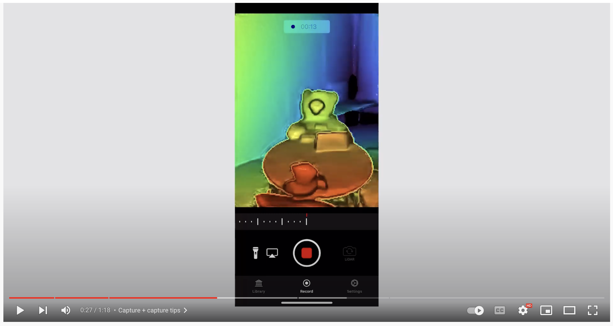
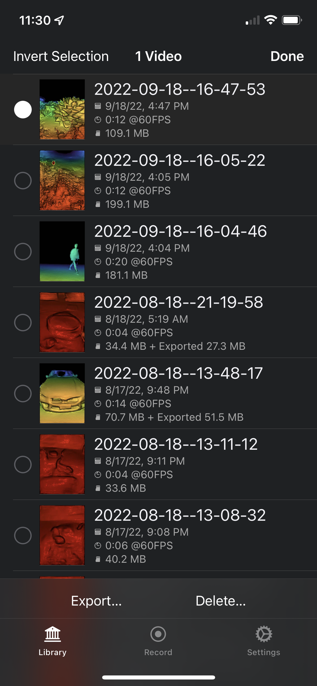
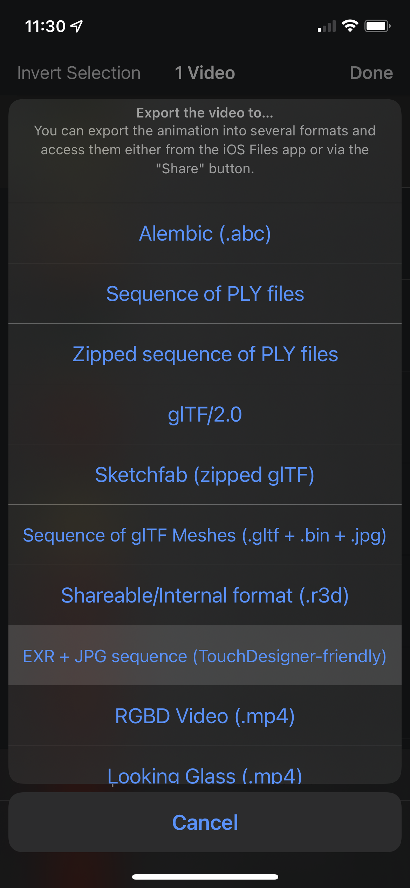
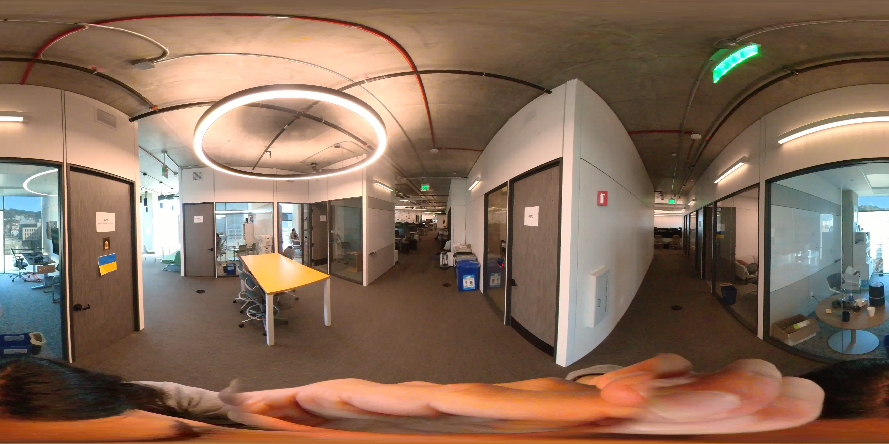

# Using custom data

Training model on existing datasets is only so fun. If you would like to train on self captured data you will need to process the data into the nerfstudio format. Specifically we need to know the camera poses for each image.

To process your own data run:

```bash
ns-process-data {video,images,polycam,record3d} --data {DATA_PATH} --output-dir {PROCESSED_DATA_DIR}
```

A full set of arguments can be found {doc}`here</reference/cli/ns_process_data>`.

We Currently support the following custom data types:
| Data | Capture Device | Requirements | `ns-process-data` Speed |
| ----------------------------- | -------------- | ----------------------------------------------- | ----------------------- |
| 📷 [Images](images_and_video) | Any | [COLMAP](https://colmap.github.io/install.html) | 🐢 |
| 📹 [Video](images_and_video) | Any | [COLMAP](https://colmap.github.io/install.html) | 🐢 |
| 🌎 [360 Data](360_data) | Any | [COLMAP](https://colmap.github.io/install.html) | 🐢 |
| 📱 [Polycam](polycam) | IOS with LiDAR | [Polycam App](https://poly.cam/) | 🐇 |
| 📱 [KIRI Engine](kiri) | IOS or Android | [KIRI Engine App](https://www.kiriengine.com/) | 🐇 |
| 📱 [Record3D](record3d) | IOS with LiDAR | [Record3D app](https://record3d.app/) | 🐇 |
| 🖥 [Metashape](metashape) | Any | [Metashape](https://www.agisoft.com/) | 🐇 |
| 🖥 [RealityCapture](realitycapture) | Any | [RealityCapture](https://www.capturingreality.com/realitycapture) | 🐇 |

(images_and_video)=

## Images or Video

To assist running on custom data we have a script that will process a video or folder of images into a format that is compatible with nerfstudio. We use [COLMAP](https://colmap.github.io) and [FFmpeg](https://ffmpeg.org/download.html) in our data processing script, please have these installed. We have provided a quickstart to installing COLMAP below, FFmpeg can be downloaded from [here](https://ffmpeg.org/download.html)

:::{admonition} Tip
:class: info

- COLMAP can be finicky. Try your best to capture overlapping, non-blurry images.
  :::

### Processing Data

```bash
ns-process-data {images, video} --data {DATA_PATH} --output-dir {PROCESSED_DATA_DIR}
```

### Training on your data

```bash
ns-train nerfacto --data {PROCESSED_DATA_DIR}
```

### Installing COLMAP

There are many ways to install COLMAP, unfortunately it can sometimes be a bit finicky. If the following commands do not work, please refer to the [COLMAP installation guide](https://colmap.github.io/install.html) for additional installation methods. COLMAP install issues are common! Feel free to ask for help in on our [Discord](https://discord.gg/uMbNqcraFc).

::::::{tab-set}
:::::{tab-item} Linux

We recommend trying `apt`:

```
sudo apt install colmap
```

If that doesn't work, you can try VKPG:
::::{tab-set}
:::{tab-item} CUDA

```bash
git clone https://github.com/microsoft/vcpkg
cd vcpkg
./bootstrap-vcpkg.sh
./vcpkg install colmap[cuda]:x64-linux
```

:::
:::{tab-item} CPU

```bash
git clone https://github.com/microsoft/vcpkg
cd vcpkg
./bootstrap-vcpkg.sh
./vcpkg install colmap:x64-linux
```

:::
::::

If that doesn't work, you will need to build from source. Refer to the [COLMAP installation guide](https://colmap.github.io/install.html) for details.

:::::

:::::{tab-item} OSX

```bash
git clone https://github.com/microsoft/vcpkg
cd vcpkg
./bootstrap-vcpkg.sh
./vcpkg install colmap
```

:::::

:::::{tab-item} Windows

::::{tab-set}
:::{tab-item} CUDA

```bash
git clone https://github.com/microsoft/vcpkg
cd vcpkg
./bootstrap-vcpkg.bat
./vcpkg install colmap[cuda]:x64-windows
```

:::
:::{tab-item} CPU

```bash
git clone https://github.com/microsoft/vcpkg
cd vcpkg
./bootstrap-vcpkg.sh
./vcpkg install colmap:x64-windows
```

:::
::::

:::::
::::::

(polycam)=

## Polycam Capture

Nerfstudio can also be trained directly from captures from the [Polycam app](https://poly.cam//). This avoids the need to use COLMAP. Polycam's poses are globally optimized which make them more robust to drift (an issue with ARKit or SLAM methods).

To get the best results, try to reduce motion blur as much as possible and try to view the target from as many viewpoints as possible. Polycam recommends having good lighting and moving the camera slowly if using auto mode. Or, even better, use the manual shutter mode to capture less blurry images.

:::{admonition} Note
:class: info
A LiDAR enabled iPhone or iPad is necessary.
:::

### Setting up Polycam

```{image} imgs/polycam_settings.png
:width: 200
:align: center
:alt: polycam settings
```

Developer settings must be enabled in Polycam. To do this, navigate to the settings screen and select `Developer mode`. Note that this will only apply for future captures, you will not be able to process existing captures with nerfstudio.

### Process data

```{image} imgs/polycam_export.png
:width: 400
:align: center
:alt: polycam export options
```

0. Capture data in LiDAR or Room mode.

1. Tap `Process` to process the data in the Polycam app.

2. Navigate to the export app pane.

3. Select `raw data` to export a `.zip` file.

4. Convert the Polycam data into the nerfstudio format using the following command:

```bash
ns-process-data polycam --data {OUTPUT_FILE.zip} --output-dir {output directory}
```

5. Train with nerfstudio!

```bash
ns-train nerfacto --data {output directory}
```

(kiri)=

## KIRI Engine Capture

Nerfstudio can trained from data processed by the [KIRI Engine app](https://www.kiriengine.com/). This works for both Android and iPhone and does not require a LiDAR supported device.

:::{admonition} Note
:class: info
`ns-process-data` does not need to be run when using KIRI Engine.
:::

### Setting up KIRI Engine

```{image} imgs/kiri_setup.png
:width: 400
:align: center
:alt: KIRI Engine setup
```

After downloading the app, `Developer Mode` needs to be enabled. A toggle can be found in the settings menu.

### Process data

```{image} imgs/kiri_capture.png
:width: 400
:align: center
:alt: KIRI Engine setup
```

1. Navigate to captures window.

2. Select `Dev.` tab.

3. Tap the `+` button to create a new capture.

4. Choose `Camera pose` as the capture option.

5. Capture the scene and provide a name.

6. After processing is complete, export the scene. It will be sent to your email.

7. Unzip the file and run the training script (`ns-process-data` is not necessary).

```bash
ns-train nerfacto --data {kiri output directory}
```

(record3d)=

## Record3D Capture

Nerfstudio can be trained directly from >=iPhone 12 Pro captures from the [Record3D app](https://record3d.app/). This uses the iPhone's LiDAR sensors to calculate camera poses, so COLMAP is not needed.

Click on the image down below 👇 for a 1-minute tutorial on how to run nerfstudio with Record3D from start to finish.

[](https://youtu.be/XwKq7qDQCQk 'How to easily use nerfstudio with Record3D')

At a high level, you can follow these 3 steps:

1. Record a video and export with the EXR + JPG sequence format.

  
  

2. Then, move the exported capture folder from your iPhone to your computer.

3. Convert the data to the nerfstudio format.

```bash
ns-process-data record3d --data {data directory} --output-dir {output directory}
```

4. Train with nerfstudio!

```bash
ns-train nerfacto --data {output directory}
```

(metashape)=

## Metashape

1. Align your images using Metashape. `File -> Workflow -> Align Photos...`

```{image} https://user-images.githubusercontent.com/3310961/203389662-12760210-2b52-49d4-ab21-4f23bfa4a2b3.png
:width: 400
:align: center
:alt: metashape alignment
```

2. Export the camera alignment as a `xml` file. `File -> Export -> Export Cameras...`

```{image} https://user-images.githubusercontent.com/3310961/203385691-74565704-e4f6-4034-867e-5d8b940fc658.png
:width: 400
:align: center
:alt: metashape export
```

3. Convert the data to the nerfstudio format.

```bash
ns-process-data metashape --data {data directory} --xml {xml file} --output-dir {output directory}
```

4. Train with nerfstudio!

```bash
ns-train nerfacto --data {output directory}
```

(realitycapture)=

## RealityCapture

1. Align your images using RealityCapture. `ALIGNMENT -> Align Images`

2. Export the camera alignment as a `csv` file. Choose `Internal/External camera parameters`

3. Convert the data to the nerfstudio format.

```bash
ns-process-data realitycapture --data {data directory} --csv {csv file} --output-dir {output directory}
```

4. Train with nerfstudio!

```bash
ns-train nerfacto --data {output directory}
```

(360_data)=

## 360 Data (Equirectangular)

Equirectangular data is data that has been taken by a 360 camera such as Insta360. Both equirectangular image sets and videos can be processed by nerfstudio.

### Images

For a set of equirectangular images, process the data using the following command:

```bash
ns-process-data images --camera-type equirectangular --images-per-equirect {8, or 14} --crop-factor {top bottom left right} --data {data directory} --output-dir {output directory}
```

The images-per-equirect argument is the number of images that will be sampled from each equirectangular image. We have found that 8 images per equirectangular image is sufficient for most use cases so it defaults to that. However, if you find that there isn't enough detail in the nerf or that colmap is having trouble aligning the images, you can try increasing the number of images per equirectangular image to 14. See the video section below for details on cropping.

### Videos

For videos we recommend taking a video with the camera held on top of your head. This will result in any unwanted capturer to just be in the bottom of each frame image and therefore can be cropped out.

For a video, process the data using the following command:

```bash
ns-process-data video --camera-type equirectangular --images-per-equirect {8, or 14} --num-frames-target {num equirectangular frames to sample from} --crop-factor {top bottom left right} --data {data directory} --output-dir {output directory}
```

See the equirectangular images section above for a description of the `--images-per-equirect` argument.

The `num-frames-target` argument is optional but it is recommended to set it to 3*(seconds of video) frames. For example, if you have a 30 second video, you would use `--num-frames-target 90` (3*30=90). This number was chosen from a bit of experimentation and seems to work well for most videos. It is by no means a hard rule and you can experiment with different values.

The `crop-factor` argument is optional but often very helpful. This is because equirectangular videos taken by 360 cameras tend to have a portion of the bottom of the image that is the person who was holding the camera over their head.

  

This obscene mesh of human is obviously not helpful in training a nerf so we can remove it by cropping the bottom 20% of the image. This can be done by using the `--crop-factor 0 0.2 0 0` argument.
