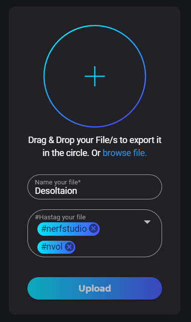

# Exporting your model to NVOL for Unreal Engine

<p align="center">
    
</p>


## Overview

NVOL is a new standard file format to store NeRFs in a fast and efficient way. NVOL files can be obtained from NeRFStudio checkpoints files (.ckpt) using Volinga Suite (https://volinga.ai/).


> ⚠️ Volinga Suite is not yet publicly available. Sign up for the beta at https://volinga.ai/ to get access.


## Exporting your model to NVOL
Currently NVOL file only supports Volinga model (which is based on nerfacto). You can train your model using the following command:

```bash
ns-train volinga --data /path/to/your/data --vis viewer
```

Once the training is done, you can find your checkpoint file in the `outputs/path-to-your-data/volinga` folder. Then, you can drag it to Volinga Suite to export it to NVOL.

<p align="center">
    
</p>

Once the NVOL is ready, you can download it and use it in Unreal Engine.

<p align="center">
    
</p>
