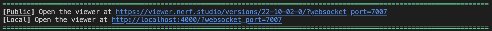

# Setting up viewer

## Training on a local machine

You should be able to click the link obtained while running a script to open the viewer in your browser.


## Training on a remote machine

If you are training on a remote maching, the viewer will still let you view your trainings. You will need to forward the port that the viewer is running on. For example, if you are running the viewer on port 7007, you will need to forward that port to your local machine. You can (without needing to modify router port settings) simply do this by opening a new terminal window and sshing into the remote machine with the following command:

```bash
ssh -L 7007:localhost:7007 <username>@<remote-machine-ip>
```
So long as you don't close this terminal window with this specific active ssh connection, the port will remain open for all your other ssh sessions. For example, if you do this in a new terminal window, any existing ssh sessions (terminal windows, VSCode remote connection, etc) will still be able to access the port, but if you close this terminal window, the port will be closed.

You can now simply open the link (the one printed when you begin your train script) in your browser on your local machine and it should connect!


If the port is being used, you can simply switch the port using the `--viewer.websocket-port` flag tied to the model subcommand.