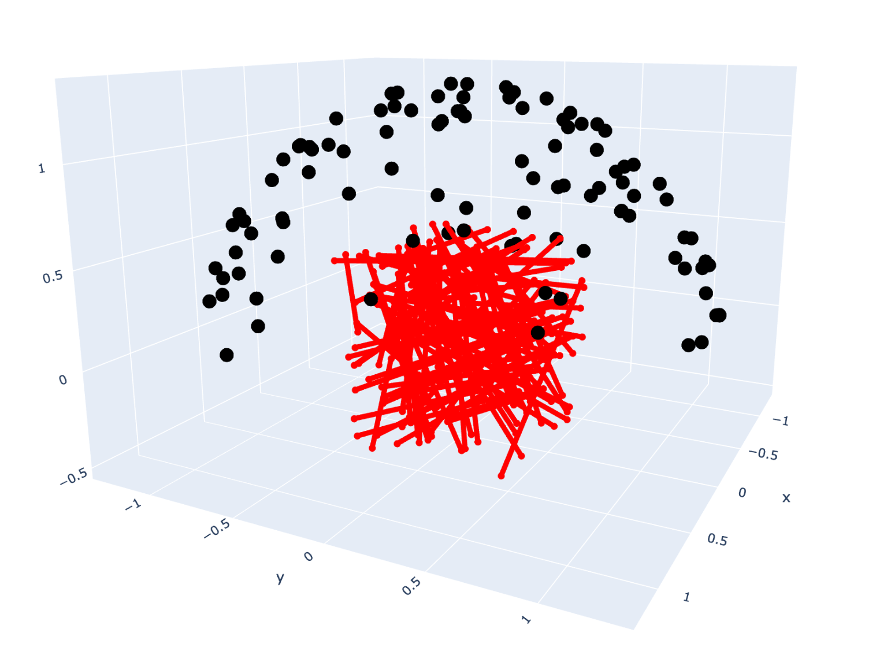

# Using custom data

#### Running COLMAP on your own images

Please download [this file](https://github.com/NVlabs/instant-ngp/blob/07d8e2ca7232f97397ab73af9b56c7db639d3445/scripts/colmap2nerf.py) and place it at `scripts/colmap2nerf.py` courtesy of the [Instant-NGP](https://github.com/NVlabs/instant-ngp) authors. This script will use [COLMAP](https://github.com/colmap/colmap) to process images of a video file into a reconstruction with camera poses. You can see their write-up [here](https://github.com/NVlabs/instant-ngp/blob/master/docs/nerf_dataset_tips.md) for instructions.

For example, maybe we have a video named `bear.mp4`. We can use the commands described in the Instant-NGP repo to create our dataset. We first create a a data folder. Then, we navigate to this folder. Finally, we run the colmap2nerf.py script with a specified `video_fps` and `aabb_scale`. The recommended number of frames is around 50-150 and the `aabb_scale` is the extent of the scene. The origin is the center of the aabb and `aabb_scale` is the length of each side of the box.

```bash
# Navigate to the repo.
cd /path/to/pyrad

# Setup the environment variables.
PYRAD_DIR=`pwd`
DATASET_FORMAT=instant_ngp
DATASET_NAME=bear

# Create and navigate to the data folder.
mkdir data/$DATASET_FORMAT/$DATASET_NAME
cd data/$DATASET_FORMAT/$DATASET_NAME

# Run the COLMAP script.
python $PYRAD_DIR/scripts/colmap2nerf.py \
    --video_in /path/to/bear.mp4 \
    --video_fps 2 \
    --run_colmap \
    --aabb_scale 16
```

###### Referring to a specific dataset

Here is how we refer to a dataset. We have a `dataset_inputs_train` and a `dataset_inputs_eval` config. These live under the `data` directory. You can see `configs/graph_default.yaml` for more details on what a full config would look like.

```yaml
data:
  dataset_inputs_train:
    data_directory: data/instant_ngp/fox
    dataset_format: instant_ngp
    downscale_factor: 1
    alpha_color: white
  dataset_inputs_eval:
    data_directory: data/instant_ngp/fox
    dataset_format: instant_ngp
    downscale_factor: 1
    alpha_color: white
```

#### Sanity check with a notebook

You can use `notebooks/visualize_dataset.ipynb` to see how your formatted dataset looks. This code will load a dataset from a yaml config, show the camera poses, and visualize rays with the specified collider in the config. TODO: add a better visualization with images too



#### Handling a new dataset type

In this page, we explain how to use pyRad with your own data. We've implemented many common datasets inside the `pyrad/format/<dataset_format>.py` files. Each of these files implements a function called `load_<dataset_format>_data`. Each of these functions returns a `DatasetInputs` object. Furthermore, `get_dataset_inputs` in `pyrad/data/utils.py` will have to be updated to handle the new function.

```python
# The DatasetInputs dataclass that is passed around to create datasets and initialize the graphs.
# See `pyrad/data/structs.py` for the code.
@dataclass
class DatasetInputs:
    """Dataset inputs are used to initialize datasets and the NeRF graph."""

    image_filenames: List[str]
    downscale_factor: int = 1
    intrinsics: torch.tensor = None
    camera_to_world: torch.tensor = None
    mask_filenames: List[str] = None
    depth_filenames: List[str] = None
    scene_bounds: SceneBounds = SceneBounds()
    semantics: Semantics = Semantics()
    point_cloud: PointCloud = PointCloud()
    alpha_color: Optional[TensorType[3]] = None

# The method signature for the `instant_ngp` dataset format.
# See `pyrad/data/format/instant_ngp.py` for the code.
def load_instant_ngp_data(
    basedir: str,
    downscale_factor: int = 1,
    split: str = "train", camera_translation_scalar=0.33
) -> DatasetInputs:
    """Returns a DatasetInputs struct."""

# The method signature for get_dataset_inputs.
# Notice that the parameters match the yaml config parameters above.
# See `pyrad/data/utils.py` for the code.
def get_dataset_inputs(
    data_directory: str,
    dataset_format: str,
    split: str,
    downscale_factor: int = 1,
    alpha_color: Optional[Union[str, list, ListConfig]] = None,
) -> DatasetInputs:
    """Makes a call to `load_<dataset_format>_data` and returns a DatasetInputs struct."""
```
