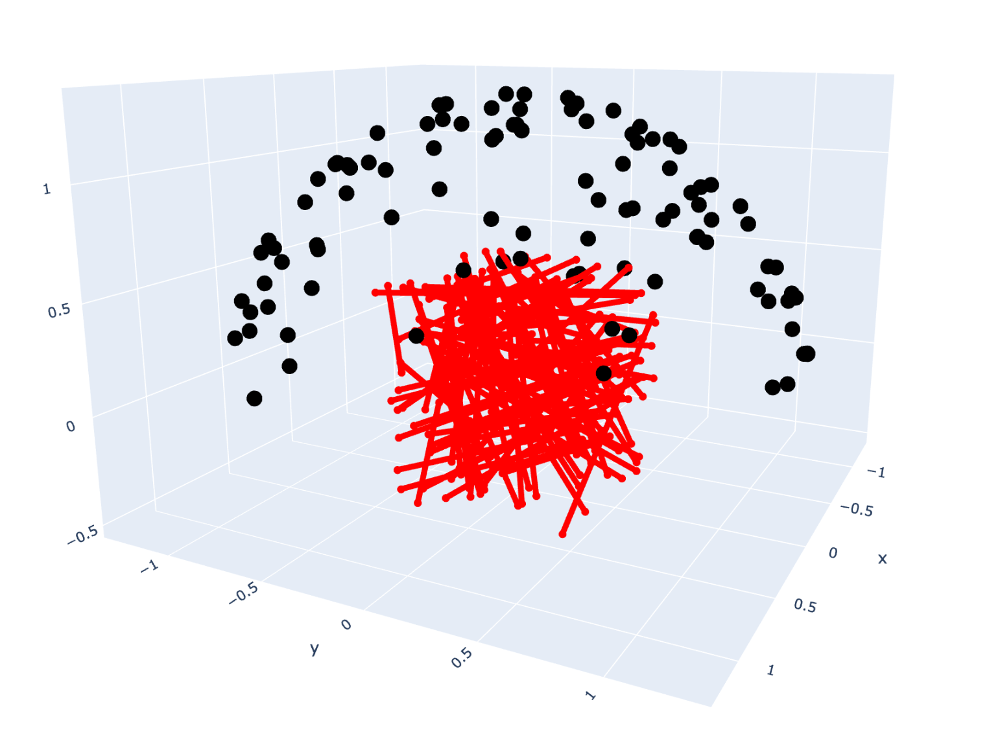

# Dataset configuration

#### Specifying dataset

The dataset path and type is specified in the model config. Both `dataset_inputs_train` and a `dataset_inputs_eval` need to be set. You can see `configs/graph_default.yaml` for more details on what a full config would look like.

```yaml
data:
  dataset_inputs_train:
    data_directory: data/instant_ngp/fox
    dataset_format: instant_ngp
    downscale_factor: 1
    alpha_color: white
  dataset_inputs_eval:
    data_directory: data/instant_ngp/fox
    dataset_format: instant_ngp
    downscale_factor: 1
    alpha_color: white
```

#### Visualize dataset

You can use `notebooks/visualize_dataset.ipynb` to see how your formatted dataset looks. This code will load a dataset from a yaml config, show the camera poses, and visualize rays with the specified collider in the config. TODO: add a better visualization with images too




#### Supported datasets

We include support for a set of standard dataset formats. 

###### Blender Synthetic

```{button-link} https://drive.google.com/drive/u/1/folders/128yBriW1IG_3NJ5Rp7APSTZsJqdJdfc1
:color: primary
:outline:
Download
```

```yaml
dataset_format: blender
```

Classic NeRF dataset including the "lego bulldozer" scene that was released with the original NeRF paper.

###### Instant NGP

```{button-link} https://github.com/NVlabs/instant-ngp#nerf-fox
:color: primary
:outline:
Download
```

```yaml
dataset_format: instant_ngp
```

###### MipNeRF 360

```{button-link} https://jonbarron.info/mipnerf360/
:color: primary
:outline:
Download
```

```yaml
dataset_format: mipnerf_360
```

###### Record3D

```{button-link} https://record3d.app/
:color: primary
:outline:
Download
```

```yaml
dataset_format: record_3d
```

Directly import dataset recorded from a >= iPhone 12 Pro using the Record3D app.

Record a video and export with the `EXR + JPG sequence` format. Unzip export and `rgb` folder before training.