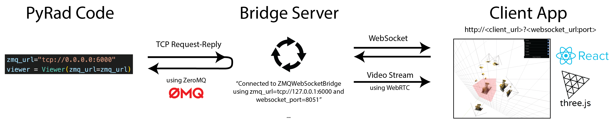

# Real-time Viewer

We provide a real-time viewer that can be used during training or to view a trained model. The purpose of the viewer is to be able to freely move the camera and see the reconstruction from novel viewpoints. It can also be used to draw various primitives (e.g., bounding boxes, camera frustums, etc.).

The viewer is built using [ThreeJS](https://threejs.org/) and packaged into a [ReactJS](https://reactjs.org/) application. This client viewer application will connect via a websocket to a server running on your machine. The following figure helps to illustrate how our viewer framework works:



## Quick start

```
# run training script with the viewer

```

<hr>

## For developers

#### Connection between PyRad and the Bridge Server

In the center, we have the Bridge Server, which facilitates the connection between PyRad code and the Client App. This server runs on the same machine that you are using PyRad. It has a TCP Request/Reply (REQ/REP) connection that PyRad can connect to with the Viewer object (left). We use [ZeroMQ](https://zeromq.org/), an open-sourced messaging library, to implement this lightweight TCP connection. The Viewer class can send commands to the Bridge Server and receive replies. The Bridge Server will either dispatch commands to the Client App via a websocket or it will return information stored in the Bridge Server state.

#### Connection between the Bridge Server and the Client App

The connection between the Bridge Server and the Client App works with WebSockets and WebRTC.

- **WebSocket connection** - The WebSocket is used by the Bridge Server to dispatch commands coming from the PyRad TCP connection. Commands can be used for drawing primitives in the [JSON Object Scene format](https://github.com/mrdoob/three.js/wiki/JSON-Object-Scene-format-4), for setting the transform of objects, for the setting various properties, and more.

- **WebRTC connection** - We use WebRTC to stream images being rendered from PyRad. The websocket connection if first used to establish the WebRTC connection. Then, the Client App constantly publishes camera pose information to the Bridge Server and stores the camera information (intrinsics and extrinsics). This information is then queried from the PyRad code, used to render an image with some Graph, and then the image is send over the TCP connection and dispatched via WebRTC to render the stream of images.

## Getting started

#### Running the Bridge Server

The viewer server runs on the same machine that you use for training. The training code will connect to the server with a lightweight TCP connection.

```
cd pyrad

# run the server on your machine
# this will run in the background
python scripts/run_viewer_server.py

It should print out something of the form:
"ZMQWebSocketBridge using zmq_url=tcp://127.0.0.1:6000 and websocket_port=8051"
```

#### Running the Client App

> We will host the viewer online in the future, but for now we have to run it locally.

```
cd pyard

cd pyrad/viewer/app

# install yarn and package.json dependencies
npm install --global yarn

yarn install
yarn start

# forward port and open in your local browser
# the URL takes the following form
# http://localhost:<forwarded_react_port>/localhost:<forwarded_backend_tcp_port>
http://localhost:4000/localhost:8051
```

Possibly edit the port in `app/.env.development` file with the following:

```
BROWSER=none
FAST_REFRESH=false
HOST=localhost
PORT=4000
```

#### Running the PyRad Code

- **Notebook demo** - See `notebooks/visualize_viewer.ipynb` for an overview for how to interact with the viewer with the Viewer object from PyRad.

## Features checklist

- [x] WebRTC video stream
- [x] Dynamic Resolution Scaling (DRS)
- [ ] Draw camera frustums from the DatasetInputs

## Acknowledgements and references

We thank [Robin Deits](https://github.com/rdeits) and other contributors to the following repos, which we've started with and modified and extended for our use.

- [meshcat-python](https://github.com/rdeits/meshcat-python)
- [meshcat](https://github.com/rdeits/meshcat)

Here are other resources that we've used and/or have found helpful while building the viewer code.

- [ThreeJS](https://threejs.org/)
- [ReactJS](https://reactjs.org/)
- [WebRTC](https://webrtc.org/) - WebRTC is a framework for real-time communication that allows two peers to send video, audio, or general data to and from each other with low latency. We've adopted WebRTC to stream rendered images to our viewer.
