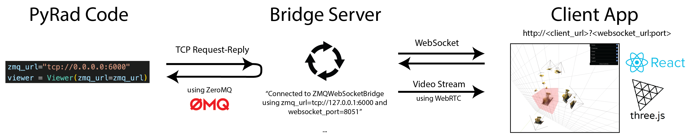
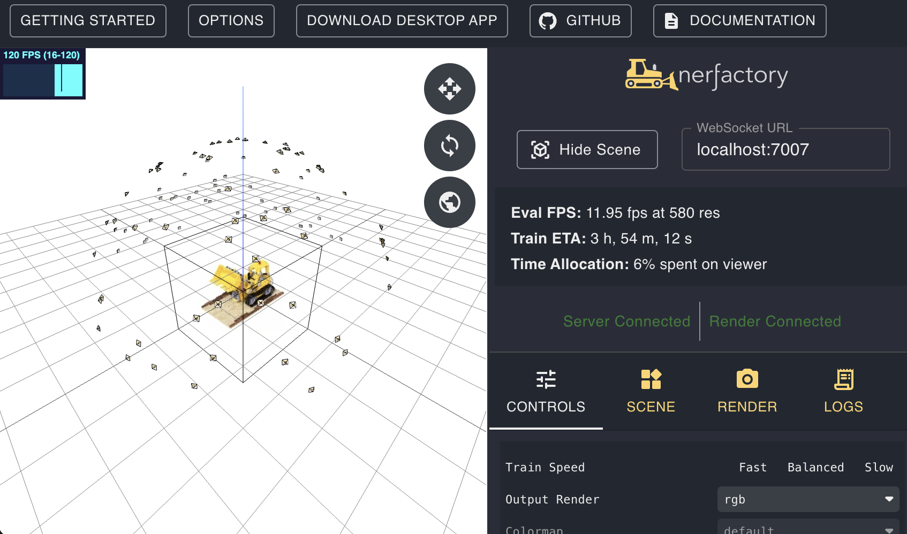

# Quickstart

We provide a real-time, web-based viewer that can be used during training or to view a trained model. The purpose of the viewer is to be able to freely move the camera and see the reconstruction from novel viewpoints. It can also be used to draw various primitives (e.g., bounding boxes, camera frustums, etc.).

The viewer is built using [ThreeJS](https://threejs.org/) and packaged into a [ReactJS](https://reactjs.org/) application. This client viewer application will connect via a websocket to a server running on your machine. The following figure helps to illustrate how our viewer framework works:



## Run hosted web viewer

1. Open the Client App Viewer at ... [https://viewer.nerf.studio/latest/?localhost:7007](https://viewer.nerf.studio/latest/?localhost:8051) but make sure to change `localhost:7007` accordingly.

2. Run training script with viewer enabled. Note that you should only use the viewer with a fast pipeline, such as instant ngp.
   ```shell
   python scripts/train.py --config-name=graph_instant_ngp.yaml viewer.enable=True
   ```

This pulls up a hosted web-viewer which is the fastest way to get started with visualizing your nerfstudio training progress!



If you want to host the viewer locally/yourself, please proceed to "For devleopers" section.
