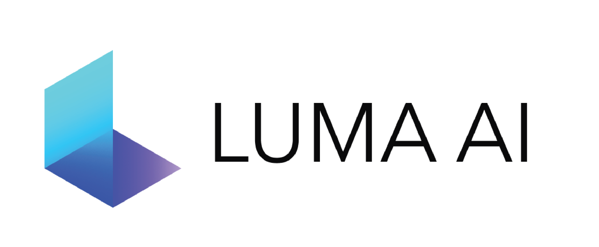
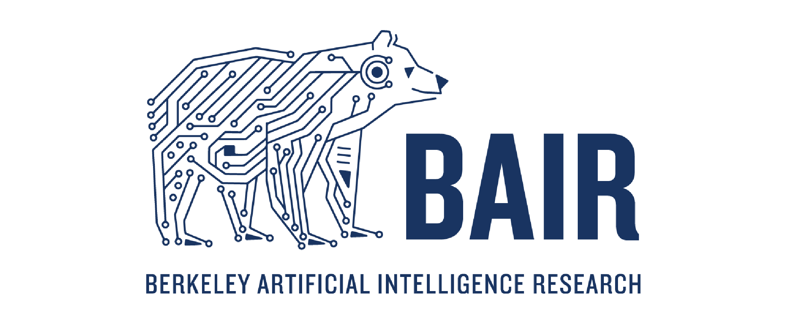

<p align="center">
    <!-- community badges -->
    <a href="https://discord.gg/uMbNqcraFc"></a>
    <!-- doc badges -->
    <a href='https://docs.nerf.studio/'>
        </a>
    <!-- pi package badge -->
    <a href="https://badge.fury.io/py/nerfstudio"></a>
    <!-- code check badges -->
    <a href='https://github.com/nerfstudio-project/nerfstudio/actions/workflows/core_code_checks.yml'>
        </a>
    <!-- license badge -->
    <a href="https://github.com/nerfstudio-project/nerfstudio/blob/master/LICENSE">
        </a>
</p>

<p align="center">
    <!-- pypi-strip -->
    <picture>
    <source media="(prefers-color-scheme: dark)" srcset="https://docs.nerf.studio/_images/logo-dark.png">
    <source media="(prefers-color-scheme: light)" srcset="https://docs.nerf.studio/_images/logo.png">
    <!-- /pypi-strip -->
    
    <!-- pypi-strip -->
    </picture>
    <!-- /pypi-strip -->
</p>

<!-- Use this for pypi package (and disable above). Hacky workaround -->
<!-- <p align="center">
    
</p> -->

<p align="center"> A collaboration friendly studio for NeRFs </p>

<p align="center">
    <a href="https://docs.nerf.studio">
        </a>
    <a href="https://viewer.nerf.studio/">
        </a>
    <a href="https://colab.research.google.com/github/nerfstudio-project/nerfstudio/blob/main/colab/demo.ipynb">
        </a>
</p>

 

- [Quickstart](#quickstart)
- [Learn more](#learn-more)
- [Supported Features](#supported-features)

# About

_It’s as simple as plug and play with nerfstudio!_

Nerfstudio provides a simple API that allows for a simplified end-to-end process of creating, training, and testing NeRFs.
The library supports a **more interpretable implementation of NeRFs by modularizing each component.**
With more modular NeRFs, we hope to create a more user-friendly experience in exploring the technology.

This is a contributor-friendly repo with the goal of building a community where users can more easily build upon each other's contributions.
Nerfstudio initially launched as an opensource project by Berkeley students in [KAIR lab](https://people.eecs.berkeley.edu/~kanazawa/index.html#kair) at [Berkeley AI Research (BAIR)](https://bair.berkeley.edu/) in October 2022 as a part of a research project ([paper](https://arxiv.org/abs/2302.04264)). It is currently developed by Berkeley students and community contributors.

We are committed to providing learning resources to help you understand the basics of (if you're just getting started), and keep up-to-date with (if you're a seasoned veteran) all things NeRF. As researchers, we know just how hard it is to get onboarded with this next-gen technology. So we're here to help with tutorials, documentation, and more!

Have feature requests? Want to add your brand-spankin'-new NeRF model? Have a new dataset? **We welcome [contributions](https://docs.nerf.studio/reference/contributing.html)!** Please do not hesitate to reach out to the nerfstudio team with any questions via [Discord](https://discord.gg/uMbNqcraFc).

Have feedback? We'd love for you to fill out our [Nerfstudio Feedback Form](https://forms.gle/sqN5phJN7LfQVwnP9) if you want to let us know who you are, why you are interested in Nerfstudio, or provide any feedback!

We hope nerfstudio enables you to build faster :hammer: learn together :books: and contribute to our NeRF community :sparkling_heart:.

## Sponsors

Sponsors of this work includes [Luma AI](https://lumalabs.ai/) and the [BAIR commons](https://bcommons.berkeley.edu/home).

<p align="left">
    <a href="https://lumalabs.ai/">
        <!-- pypi-strip -->
        <picture>
        <source media="(prefers-color-scheme: dark)" srcset="docs/_static/imgs/luma_dark.png">
        <source media="(prefers-color-scheme: light)" srcset="docs/_static/imgs/luma_light.png">
        <!-- /pypi-strip -->
        
        <!-- pypi-strip -->
        </picture>
        <!-- /pypi-strip -->
    </a>
    <a href="https://bcommons.berkeley.edu/home">
        <!-- pypi-strip -->
        <picture>
        <source media="(prefers-color-scheme: dark)" srcset="docs/_static/imgs/bair_dark.png">
        <source media="(prefers-color-scheme: light)" srcset="docs/_static/imgs/bair_light.png">
        <!-- /pypi-strip -->
        
        <!-- pypi-strip -->
        </picture>
        <!-- /pypi-strip -->
    </a>
</p>

# Quickstart

The quickstart will help you get started with the default vanilla NeRF trained on the classic Blender Lego scene.
For more complex changes (e.g., running with your own data/setting up a new NeRF graph), please refer to our [references](#learn-more).

## 1. Installation: Setup the environment

### Prerequisites

You must have an NVIDIA video card with CUDA installed on the system. This library has been tested with version 11.8 of CUDA. You can find more information about installing CUDA [here](https://docs.nvidia.com/cuda/cuda-quick-start-guide/index.html)

### Create environment

Nerfstudio requires `python >= 3.8`. We recommend using conda to manage dependencies. Make sure to install [Conda](https://docs.conda.io/miniconda.html) before proceeding.

```bash
conda create --name nerfstudio -y python=3.8
conda activate nerfstudio
pip install --upgrade pip
```

### Dependencies

Install PyTorch with CUDA (this repo has been tested with CUDA 11.7 and CUDA 11.8) and [tiny-cuda-nn](https://github.com/NVlabs/tiny-cuda-nn).
`cuda-toolkit` is required for building `tiny-cuda-nn`.

For CUDA 11.8:

```bash
pip install torch==2.1.2+cu118 torchvision==0.16.2+cu118 --extra-index-url https://download.pytorch.org/whl/cu118

conda install -c "nvidia/label/cuda-11.8.0" cuda-toolkit
pip install ninja git+https://github.com/NVlabs/tiny-cuda-nn/#subdirectory=bindings/torch
```

See [Dependencies](https://github.com/nerfstudio-project/nerfstudio/blob/main/docs/quickstart/installation.md#dependencies)
in the Installation documentation for more.

### Installing nerfstudio

Easy option:

```bash
pip install nerfstudio
```

**OR** if you want the latest and greatest:

```bash
git clone https://github.com/nerfstudio-project/nerfstudio.git
cd nerfstudio
pip install --upgrade pip setuptools
pip install -e .
```

**OR** if you want to skip all installation steps and directly start using nerfstudio, use the docker image:

See [Installation](https://github.com/nerfstudio-project/nerfstudio/blob/main/docs/quickstart/installation.md) - **Use docker image**.

## 2. Training your first model!

The following will train a _nerfacto_ model, our recommended model for real world scenes.

```bash
# Download some test data:
ns-download-data nerfstudio --capture-name=poster
# Train model
ns-train nerfacto --data data/nerfstudio/poster
```

If everything works, you should see training progress like the following:

<p align="center">
    
</p>

Navigating to the link at the end of the terminal will load the webviewer. If you are running on a remote machine, you will need to port forward the websocket port (defaults to 7007).

<p align="center">
    
</p>

### Resume from checkpoint / visualize existing run

It is possible to load a pretrained model by running

```bash
ns-train nerfacto --data data/nerfstudio/poster --load-dir {outputs/.../nerfstudio_models}
```

## Visualize existing run

Given a pretrained model checkpoint, you can start the viewer by running

```bash
ns-viewer --load-config {outputs/.../config.yml}
```

## 3. Exporting Results

Once you have a NeRF model you can either render out a video or export a point cloud.

### Render Video

First we must create a path for the camera to follow. This can be done in the viewer under the "RENDER" tab. Orient your 3D view to the location where you wish the video to start, then press "ADD CAMERA". This will set the first camera key frame. Continue to new viewpoints adding additional cameras to create the camera path. We provide other parameters to further refine your camera path. Once satisfied, press "RENDER" which will display a modal that contains the command needed to render the video. Kill the training job (or create a new terminal if you have lots of compute) and run the command to generate the video.

Other video export options are available, learn more by running

```bash
ns-render --help
```

### Generate Point Cloud

While NeRF models are not designed to generate point clouds, it is still possible. Navigate to the "EXPORT" tab in the 3D viewer and select "POINT CLOUD". If the crop option is selected, everything in the yellow square will be exported into a point cloud. Modify the settings as desired then run the command at the bottom of the panel in your command line.

Alternatively you can use the CLI without the viewer. Learn about the export options by running

```bash
ns-export pointcloud --help
```

## 4. Using Custom Data

Using an existing dataset is great, but likely you want to use your own data! We support various methods for using your own data. Before it can be used in nerfstudio, the camera location and orientations must be determined and then converted into our format using `ns-process-data`. We rely on external tools for this, instructions and information can be found in the documentation.

| Data                                                                                          | Capture Device | Requirements                                                      | `ns-process-data` Speed |
| --------------------------------------------------------------------------------------------- | -------------- | ----------------------------------------------------------------- | ----------------------- |
| 📷 [Images](https://docs.nerf.studio/quickstart/custom_dataset.html#images-or-video)          | Any            | [COLMAP](https://colmap.github.io/install.html)                   | 🐢                      |
| 📹 [Video](https://docs.nerf.studio/quickstart/custom_dataset.html#images-or-video)           | Any            | [COLMAP](https://colmap.github.io/install.html)                   | 🐢                      |
| 🌎 [360 Data](https://docs.nerf.studio/quickstart/custom_dataset.html#data-equirectangular)   | Any            | [COLMAP](https://colmap.github.io/install.html)                   | 🐢                      |
| 📱 [Polycam](https://docs.nerf.studio/quickstart/custom_dataset.html#polycam-capture)         | IOS with LiDAR | [Polycam App](https://poly.cam/)                                  | 🐇                      |
| 📱 [KIRI Engine](https://docs.nerf.studio/quickstart/custom_dataset.html#kiri-engine-capture) | IOS or Android | [KIRI Engine App](https://www.kiriengine.com/)                    | 🐇                      |
| 📱 [Record3D](https://docs.nerf.studio/quickstart/custom_dataset.html#record3d-capture)       | IOS with LiDAR | [Record3D app](https://record3d.app/)                             | 🐇                      |
| 📱 [Spectacular AI](https://docs.nerf.studio/quickstart/custom_dataset.html#spectacularai)    | IOS, OAK, [others](https://www.spectacularai.com/mapping#supported-devices) | [App](https://apps.apple.com/us/app/spectacular-rec/id6473188128) / [`sai-cli`](https://www.spectacularai.com/mapping) | 🐇 |
| 🖥 [Metashape](https://docs.nerf.studio/quickstart/custom_dataset.html#metashape)             | Any            | [Metashape](https://www.agisoft.com/)                             | 🐇                      |
| 🖥 [RealityCapture](https://docs.nerf.studio/quickstart/custom_dataset.html#realitycapture)   | Any            | [RealityCapture](https://www.capturingreality.com/realitycapture) | 🐇                      |
| 🖥 [ODM](https://docs.nerf.studio/quickstart/custom_dataset.html#odm)                         | Any            | [ODM](https://github.com/OpenDroneMap/ODM)                        | 🐇                      |
| 👓 [Aria](https://docs.nerf.studio/quickstart/custom_dataset.html#aria)                       | Aria glasses   | [Project Aria](https://projectaria.com/)                          | 🐇                      |
| 🛠 [Custom](https://docs.nerf.studio/quickstart/data_conventions.html)                        | Any            | Camera Poses                                                      | 🐇                      |


## 5. Advanced Options

### Training models other than nerfacto

We provide other models than nerfacto, for example if you want to train the original nerf model, use the following command

```bash
ns-train vanilla-nerf --data DATA_PATH
```

For a full list of included models run `ns-train --help`.

### Modify Configuration

Each model contains many parameters that can be changed, too many to list here. Use the `--help` command to see the full list of configuration options.

```bash
ns-train nerfacto --help
```

### Tensorboard / WandB / Viewer

We support four different methods to track training progress, using the viewer[tensorboard](https://www.tensorflow.org/tensorboard), [Weights and Biases](https://wandb.ai/site), and ,[Comet](https://comet.com/?utm_source=nerf&utm_medium=referral&utm_content=github). You can specify which visualizer to use by appending `--vis {viewer, tensorboard, wandb, comet viewer+wandb, viewer+tensorboard, viewer+comet}` to the training command. Simultaneously utilizing the viewer alongside wandb or tensorboard may cause stuttering issues during evaluation steps. The viewer only works for methods that are fast (ie. nerfacto, instant-ngp), for slower methods like NeRF, use the other loggers.

# Learn More

And that's it for getting started with the basics of nerfstudio.

If you're interested in learning more on how to create your own pipelines, develop with the viewer, run benchmarks, and more, please check out some of the quicklinks below or visit our [documentation](https://docs.nerf.studio/) directly.

| Section                                                                                  | Description                                                                                        |
| ---------------------------------------------------------------------------------------- | -------------------------------------------------------------------------------------------------- |
| [Documentation](https://docs.nerf.studio/)                                               | Full API documentation and tutorials                                                               |
| [Viewer](https://viewer.nerf.studio/)                                                    | Home page for our web viewer                                                                       |
| 🎒 **Educational**                                                                       |
| [Model Descriptions](https://docs.nerf.studio/nerfology/methods/index.html)              | Description of all the models supported by nerfstudio and explanations of component parts.         |
| [Component Descriptions](https://docs.nerf.studio/nerfology/model_components/index.html) | Interactive notebooks that explain notable/commonly used modules in various models.                |
| 🏃 **Tutorials**                                                                         |
| [Getting Started](https://docs.nerf.studio/quickstart/installation.html)                 | A more in-depth guide on how to get started with nerfstudio from installation to contributing.     |
| [Using the Viewer](https://docs.nerf.studio/quickstart/viewer_quickstart.html)           | A quick demo video on how to navigate the viewer.                                                  |
| [Using Record3D](https://www.youtube.com/watch?v=XwKq7qDQCQk)                            | Demo video on how to run nerfstudio without using COLMAP.                                          |
| 💻 **For Developers**                                                                    |
| [Creating pipelines](https://docs.nerf.studio/developer_guides/pipelines/index.html)     | Learn how to easily build new neural rendering pipelines by using and/or implementing new modules. |
| [Creating datasets](https://docs.nerf.studio/quickstart/custom_dataset.html)             | Have a new dataset? Learn how to run it with nerfstudio.                                           |
| [Contributing](https://docs.nerf.studio/reference/contributing.html)                     | Walk-through for how you can start contributing now.                                               |
| 💖 **Community**                                                                         |
| [Discord](https://discord.gg/uMbNqcraFc)                                                 | Join our community to discuss more. We would love to hear from you!                                |
| [Twitter](https://twitter.com/nerfstudioteam)                                            | Follow us on Twitter @nerfstudioteam to see cool updates and announcements                         |
| [Feedback Form](TODO)                                                                    | We welcome any feedback! This is our chance to learn what you all are using Nerfstudio for.        |

# Supported Features

We provide the following support structures to make life easier for getting started with NeRFs.

**If you are looking for a feature that is not currently supported, please do not hesitate to contact the Nerfstudio Team on [Discord](https://discord.gg/uMbNqcraFc)!**

- :mag_right: Web-based visualizer that allows you to:
  - Visualize training in real-time + interact with the scene
  - Create and render out scenes with custom camera trajectories
  - View different output types
  - And more!
- :pencil2: Support for multiple logging interfaces (Tensorboard, Wandb), code profiling, and other built-in debugging tools
- :chart_with_upwards_trend: Easy-to-use benchmarking scripts on the Blender dataset
- :iphone: Full pipeline support (w/ Colmap, Polycam, or Record3D) for going from a video on your phone to a full 3D render.

# Built On

<a href="https://github.com/brentyi/tyro">
<!-- pypi-strip -->
<picture>
    <source media="(prefers-color-scheme: dark)" srcset="https://brentyi.github.io/tyro/_static/logo-dark.svg" />
<!-- /pypi-strip -->
    
<!-- pypi-strip -->
</picture>
<!-- /pypi-strip -->
</a>

- Easy-to-use config system
- Developed by [Brent Yi](https://brentyi.com/)

<a href="https://github.com/KAIR-BAIR/nerfacc">
<!-- pypi-strip -->
<picture>
    <source media="(prefers-color-scheme: dark)" srcset="https://user-images.githubusercontent.com/3310961/199083722-881a2372-62c1-4255-8521-31a95a721851.png" />
<!-- /pypi-strip -->
    
<!-- pypi-strip -->
</picture>
<!-- /pypi-strip -->
</a>

- Library for accelerating NeRF renders
- Developed by [Ruilong Li](https://www.liruilong.cn/)

# Citation

You can find a paper writeup of the framework on [arXiv](https://arxiv.org/abs/2302.04264).

If you use this library or find the documentation useful for your research, please consider citing:

```
@inproceedings{nerfstudio,
	title        = {Nerfstudio: A Modular Framework for Neural Radiance Field Development},
	author       = {
		Tancik, Matthew and Weber, Ethan and Ng, Evonne and Li, Ruilong and Yi, Brent
		and Kerr, Justin and Wang, Terrance and Kristoffersen, Alexander and Austin,
		Jake and Salahi, Kamyar and Ahuja, Abhik and McAllister, David and Kanazawa,
		Angjoo
	},
	year         = 2023,
	booktitle    = {ACM SIGGRAPH 2023 Conference Proceedings},
	series       = {SIGGRAPH '23}
}
```

# Contributors

<a href="https://github.com/nerfstudio-project/nerfstudio/graphs/contributors">
  
</a>
