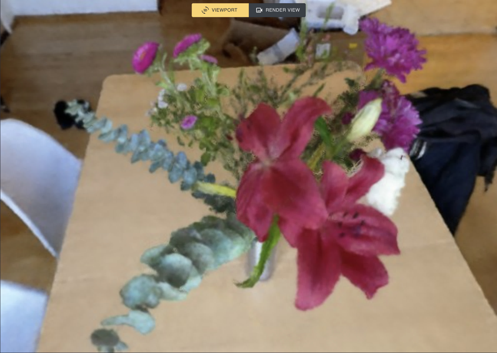
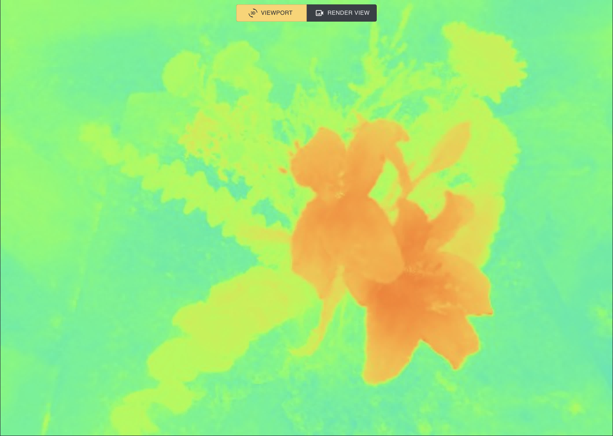
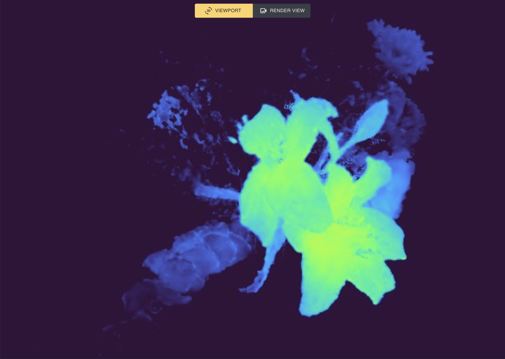
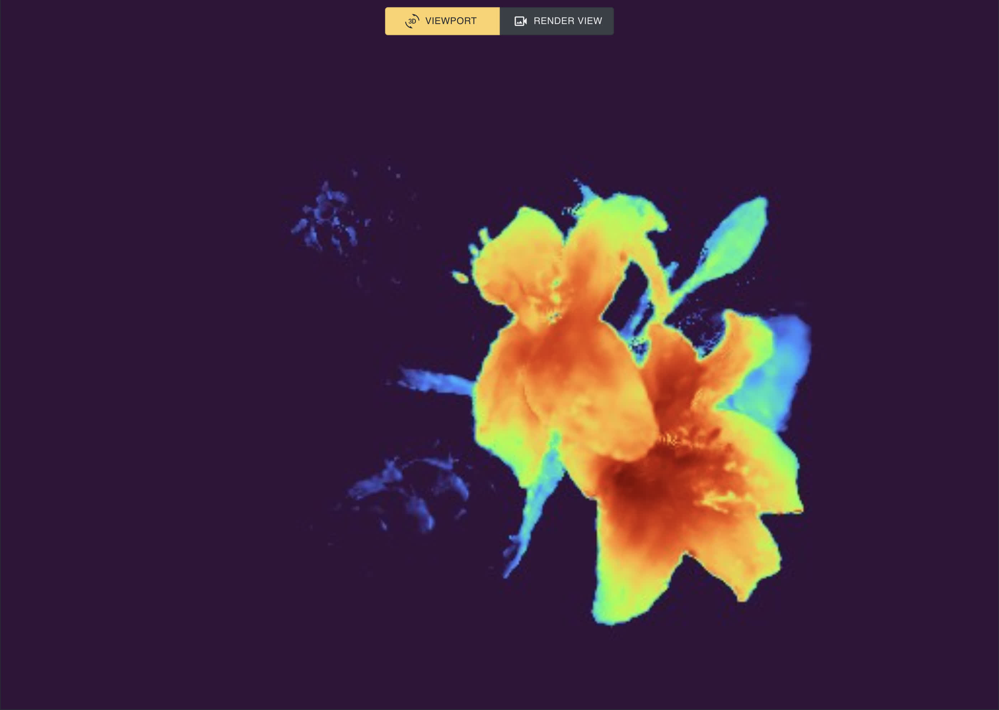

# LERF: Language Embedded Radiance Fields
This is the official implementation for [LERF](https://lerf.io).

**NOTE**: LERF is fully usable, however complete integration with Nerfstudio is not *fully* complete. Remaining TODOs:
- [ ] Refactor Nerfstudio viewer to allow adding javascript components from within model files (this will remove the need for hard-coding a textbox into the viewer)
- [ ] Integrate into `ns-render` commands to render videos from the command line with custom prompts

# Installation
LERF follows the integration guidelines described [here](https://docs.nerf.studio/en/latest/developer_guides/config.html#extending-nerfstudio-with-custom-methods) for custom methods within Nerfstudio. 

### 1. Install Nerfstudio From Source
Follow instructions [at this link](https://docs.nerf.studio/en/latest/quickstart/installation.html) to install Nerfstudio **from source**. Checkout the Nerfstudio branch `lerf-merge`.

### 2. Build the viewer
**NOTE**: When full integration is complete, this will be unnecessary, however in the meantime we need to build the viewer ourselves to enable text prompts.

Follow the instructions [at this link](https://docs.nerf.studio/en/latest/developer_guides/viewer/viewer_overview.html#installing-and-running-locally) to build the viewer locally. **Make sure you are on the branch `lerf-merge`**, since this has extra code for a textbox in the viewer.

### 3. Install the `lerf` package
Navigate to this folder and run `python -m pip install -e`. This installs entrypoints for Nerfstudio to use

### 4. Run `ns-install-cli`
This will update the Nerfstudio `ns-train` command to register the LERF method.

### Checking the install
Run `ns-train -h`: you should see a list of "subcommands" with lerf, lerf-big, and lerf-lite included among them.

# Using LERF
Now that LERF is installed you can play with it! 

- Launch training with `ns-train lerf --data <data_folder> --viewer.websocket-port <viewer_port>`. This specifies a data folder to use, as well as a port to connect to the viewer. For more details, see [Nerfstudio documentation](https://docs.nerf.studio/en/latest/quickstart/first_nerf.html)
- Launch the viewer by navigating to `nerfstudio/nerfstudio/viewer/app` and executing `yarn start`. This will provide a port number <server_port> (typically 4000).
- Connect to the viewer by forwarding the viewer port (we use VSCode to do this), and connect to `http://localhost:<server_port>/?websocket_url=ws://localhost:<viewer_port>` in your browser.
- Within the viewer, you can type text into the textbox, then select the `relevancy_0` output type to visualize relevancy maps.

## Relevancy Map Normalization
By default, the viewer shows **raw** relevancy scaled with the turbo colormap. As values lower than 0.5 correspond to irrelevant regions, **we recommend setting the `range` parameter to (-1.0, 1.0)**. To match the visualization from the paper, check the `Normalize` tick-box, which stretches the values to use the full colormap.

The images below show the rgb, raw, centered, and normalized output views for the query "Lily".

## Resolution
The Nerfstudio viewer dynamically changes resolution to achieve a desired training throughput.

**To increase resolution, pause training**. Rendering at high resolution (512 or above) can take a second or two, so we recommend rendering at 256px
